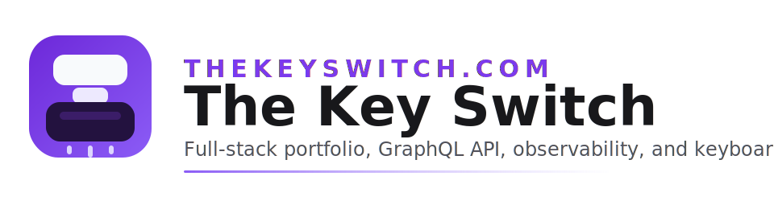

<p align="center">
  <picture>
    <source media="(prefers-color-scheme: dark)" srcset="docs/assets/thekeyswitch-logo-dark.svg">
    
  </picture>
</p>

<p align="center">
  <strong>A portfolio site and production showcase for senior-level full-stack web engineering.</strong>
</p>

<p align="center">
  <a href="https://thekeyswitch.com">Live Site</a>
  |
  <a href="ARCHITECTURE.md">Architecture</a>
  |
  <a href="SPECIFICATIONS.md">Specifications</a>
  |
  <a href="AUDIT.md">Audit</a>
</p>

<p align="center">
  
  
  
  
  
</p>

## Overview

`thekeyswitch.com` is a single-domain portfolio and systems demo built to show depth across frontend, backend, infrastructure, testing, and operations.

The stack combines:

- Next.js 15 with the App Router and React Server Components
- Spring Boot 3.4 GraphQL API on Java 21
- PostgreSQL 16 with Flyway migrations
- Docker Compose orchestration
- Caddy TLS reverse proxy
- CrowdSec request filtering
- Prometheus, node-exporter, and cAdvisor for metrics

The repo also includes several showcase features:

- A keyboard switch comparison tool with D3 force-curve charts
- A weather dashboard
- A WebXR scene
- A live system metrics page
- A GraphQL-backed admin area

## What Changed Recently

The latest security cleanup removed the old hardcoded admin seed password from Flyway and replaced it with a safer bootstrap flow:

- The first admin user is created at startup from `ADMIN_BOOTSTRAP_USERNAME` and `ADMIN_BOOTSTRAP_PASSWORD`
- Existing deployments can safely repair Flyway metadata with `scripts/flyway-repair.sh`
- Legacy seeded `changeme` credentials are removed by migration `V7__remove_legacy_seeded_admin.sql`
- Admin password rotation is now available through the GraphQL `changePassword` mutation
- Actuator endpoints are limited to internal networks via `INTERNAL_ALLOWED_NETWORKS`

If you are setting this project up for the first time, the README below is already aligned with that new flow.

## Repository Layout

```text
.
|- frontend/        Next.js application
|- api/             Spring Boot GraphQL API
|- caddy/           Caddy config and image build
|- crowdsec/        CrowdSec acquisition config
|- prometheus/      Prometheus scrape config
|- db/              Non-Flyway database init hooks
|- scripts/         Setup, deploy, and Flyway helper scripts
|- docs/assets/     README branding assets
|- ARCHITECTURE.md
|- SPECIFICATIONS.md
`- AUDIT.md
```

## Prerequisites

For the standard local Docker workflow:

- Docker Engine
- Docker Compose plugin

For running parts of the stack outside Docker:

- Node.js 22
- Java 21
- Git Bash, WSL, or another POSIX-compatible shell if you want to use the helper scripts on Windows

## Quick Start

If you just want the project running locally, this is the shortest path:

1. Clone the repo.
2. Copy `.env.example` to `.env`.
3. Set a strong `DB_PASSWORD`, `JWT_SECRET`, and `ADMIN_BOOTSTRAP_PASSWORD`.
4. Start the development stack.

```bash
git clone https://github.com/wintryKat/thekeyswitch-dot-com.git
cd thekeyswitch-dot-com
cp .env.example .env
docker compose -f docker-compose.yml -f docker-compose.dev.yml up --build
```

Once the containers are healthy, open:

- `http://localhost` - app through Caddy
- `http://localhost:3000` - frontend directly
- `http://localhost/graphql` - GraphQL through Caddy
- `http://localhost:8080/graphql` - API directly
- `http://localhost:9090` - Prometheus

To stop the stack:

```bash
docker compose -f docker-compose.yml -f docker-compose.dev.yml down
```

To remove local volumes as well:

```bash
docker compose -f docker-compose.yml -f docker-compose.dev.yml down -v
```

## Environment Variables

The root `.env` file is used by Docker Compose.

| Variable | Required | Purpose |
| --- | --- | --- |
| `DB_USER` | Yes | PostgreSQL username |
| `DB_PASSWORD` | Yes | PostgreSQL password |
| `JWT_SECRET` | Yes | JWT signing secret; use a random value at least 32 bytes long |
| `ADMIN_BOOTSTRAP_USERNAME` | Yes | Initial admin username, usually `admin` |
| `ADMIN_BOOTSTRAP_PASSWORD` | First boot only | Initial admin password used only when the database has no admin users |
| `INTERNAL_ALLOWED_NETWORKS` | Recommended | CIDR allowlist for `/actuator/health` and `/actuator/prometheus` |
| `CROWDSEC_API_KEY` | Production | Caddy bouncer key generated by CrowdSec |
| `SPRING_PROFILES_ACTIVE` | Recommended | `production` in prod, `default` in local dev |

Helpful command for generating a JWT secret:

```bash
openssl rand -base64 64
```

## First Boot and Admin Setup

This part matters because the project no longer ships a default admin password.

### Fresh database

1. Set `ADMIN_BOOTSTRAP_PASSWORD` in `.env`.
2. Start the stack.
3. Open `/admin/login` and sign in with:

```text
username: value of ADMIN_BOOTSTRAP_USERNAME
password: value of ADMIN_BOOTSTRAP_PASSWORD
```

4. Change the password immediately.
5. Remove `ADMIN_BOOTSTRAP_PASSWORD` from `.env`.
6. Restart the API container or the whole stack.

### Changing the admin password

There is currently no dedicated password screen in the admin UI, so rotate it via GraphQL after logging in.

Example:

```bash
curl http://localhost/graphql \
  -H "Content-Type: application/json" \
  -H "Authorization: Bearer <JWT_TOKEN>" \
  -d '{
    "query":"mutation ChangePassword($currentPassword: String!, $newPassword: String!) { changePassword(currentPassword: $currentPassword, newPassword: $newPassword) }",
    "variables":{
      "currentPassword":"old-password",
      "newPassword":"new-password"
    }
  }'
```

You can obtain the JWT with the `login` mutation:

```bash
curl http://localhost/graphql \
  -H "Content-Type: application/json" \
  -d '{
    "query":"mutation Login($username: String!, $password: String!) { login(username: $username, password: $password) { token expiresAt } }",
    "variables":{
      "username":"admin",
      "password":"your-password"
    }
  }'
```

## Local Development Notes

The development override file does a few useful things:

- swaps in `caddy/Caddyfile.dev`
- exposes frontend, API, database, and Prometheus ports
- mounts the frontend source tree for live iteration
- leaves the API reachable directly on `localhost:8080`

In development, Caddy does not use automatic HTTPS and does not require CrowdSec request remediation.

## Running Tests

Frontend:

```bash
cd frontend
npm ci
npm test
```

Backend:

```bash
cd api
./gradlew test
```

If you do not have Java 21 locally, the GitHub Actions workflow is the most reliable source of truth for API test execution.

## Building Production Images

Frontend image:

```bash
docker compose build frontend
```

API image:

```bash
docker compose build api
```

Or build everything:

```bash
docker compose build --parallel
```

## Flyway Repair and Existing Deployments

Because the old `V4__seed_admin_user.sql` migration used to contain a hardcoded password hash and now intentionally does not, existing deployments need one extra safety step so Flyway updates its recorded checksum.

That is what `scripts/flyway-repair.sh` is for.

Run it before `docker compose up -d` on existing environments:

```bash
./scripts/flyway-repair.sh
```

You do not need to remember this during normal deployment because:

- `scripts/deploy.sh` already runs it
- `.github/workflows/deploy.yml` already runs it in CI deploys

## Production Deployment

The project is designed for a single VPS deployment.

Typical flow:

1. Copy the repo to the server.
2. Create `.env`.
3. Generate the CrowdSec bouncer key.
4. Build and start the stack.

Example:

```bash
cp .env.example .env
# edit .env
docker compose up -d crowdsec
docker compose exec crowdsec cscli bouncers add caddy-bouncer
# copy the generated key into CROWDSEC_API_KEY in .env
docker compose build --parallel
./scripts/flyway-repair.sh
docker compose up -d
docker compose ps
```

If you have the `thekeyswitch` SSH alias configured, you can also use:

```bash
./scripts/deploy.sh
```

That script assumes the remote repo lives at `/opt/thekeyswitch`.

## Operational Notes

- The API JVM is capped at `-Xmx512m -Xms256m`.
- `/actuator/health` and `/actuator/prometheus` are intended for internal networks only.
- Prometheus scrapes the API directly on the Docker network.
- The frontend uses `graphql-request` on the server and direct `fetch` calls for client-side GraphQL requests.
- `urql` was removed because it was unused.

## Troubleshooting

### The app boots but admin login fails

Check:

- `ADMIN_BOOTSTRAP_PASSWORD` was set before first startup
- the database volume is the one you expect
- the legacy seeded admin was removed by `V7`

If the DB already contains an admin user, bootstrap will not run again.

### Flyway reports a checksum mismatch on V4

Run:

```bash
./scripts/flyway-repair.sh
```

Then restart the deployment.

### Caddy cannot start in production

Most often this is one of:

- `CROWDSEC_API_KEY` is missing or stale
- port `80` or `443` is already in use
- DNS is not pointing at the host yet

### Metrics are unavailable

Check that these services are healthy:

- `api`
- `prometheus`
- `node-exporter`
- `cadvisor`

## Documentation

For the full deep dive:

- [ARCHITECTURE.md](ARCHITECTURE.md) - end-to-end architecture decisions and deployment model
- [SPECIFICATIONS.md](SPECIFICATIONS.md) - implementation details, feature inventory, and testing notes
- [AUDIT.md](AUDIT.md) - current audit summary and remediation history

## License

[MIT](LICENSE)
